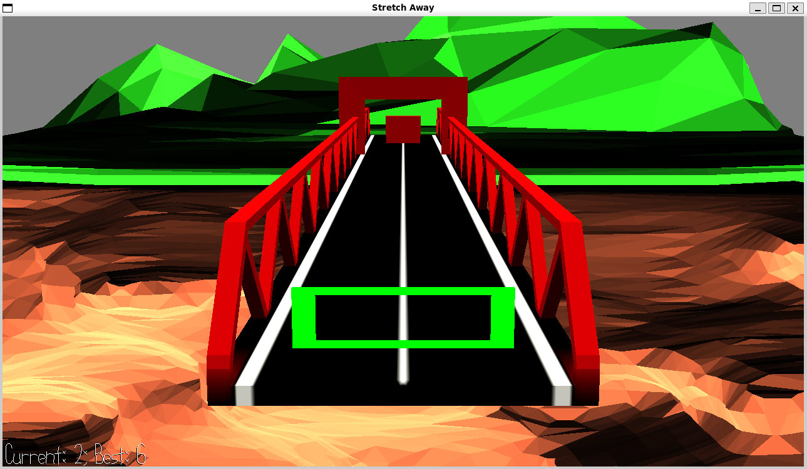

# Stretch Away

Author: Rafael Rivera

Design: Hole-in-the-wall style game, utilizing scaling rather than movement. Stretch and shrink yourself into the hole before it hits you!

Screen Shot:

How To Play:

WASD or Arrow Keys to Grow/Shrink. W/up or S/down to grow/shrink vertically, A/left or D/right to grow/shrink horizontally, respectively.

This game was built with [NEST](NEST.md).
